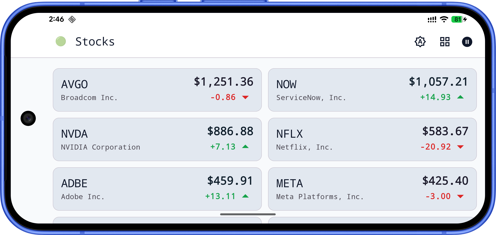
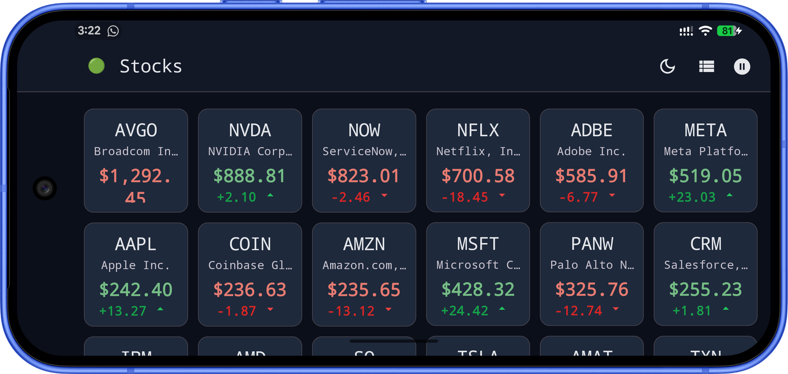

[](https://github.com/moinkhan-tech-in/AtomicTracker/actions/workflows/ci.yml)

# 📈 AtomicTracker

A **demo Android stock tracker** built with **Jetpack Compose** and a **layered architecture**. Browse a live-style quote feed, open symbol detail, and toggle streaming updates over a **real WebSocket** (Postman echo) with **reconnect and backoff** — not UI-only timers.

> The echo endpoint models a streaming transport: batched JSON is sent, echoed back, and merged into `Flow`-driven UI (`NetworkStocksDataSource` + `PostmanEchoWebSocketClient`).

## ✨ Features

- **Stock feed** — list of quotes with price and change
- **Symbol detail** — dedicated screen per ticker (type-safe navigation)
- **Live feed toggle** — pause/resume the WebSocket-driven ticker
- **Connection state** — connecting / connected / disconnected feedback in the UI
- **Theming** — Material 3 with theme controls in the app bar

## 📸 Screenshots

<p align="center">
  
  
</p>
<p align="center"><em>Feed (list)</em></p>

<p align="center">
  
  
</p>
<p align="center"><em>Feed — adaptive &amp; landscape</em></p>

<p align="center">
  
  
</p>
<p align="center"><em>Grid</em></p>

<p align="center">
  
  
</p>
<p align="center"><em>Grid — landscape</em></p>

<p align="center">
  
  
</p>
<p align="center"><em>Symbol detail</em></p>

## 🏗️ Architecture

Organized in a **single `app` module** with clear layers (Clean-style separation inside packages):

- **UI layer** — Jetpack Compose, feature screens (`feed`, `detail`), MVVM with `ViewModel` + `StateFlow`
- **Domain layer** — use cases and models under `core/domain` (no UI)
- **Data layer** — `StockRepository`, `NetworkStocksDataSource`, DTOs, mappers, WebSocket client under `core/data`
- **Navigation** — Compose Navigation with **kotlinx.serialization** routes (`FeedRoute`, `DetailRoute`)
- **Design system** — shared theme, scaffold, and components under `core/designsystem`
- **DI** — **Hilt** modules in `di/` (`NetworkModule`, `RepositoryModule`, `UseCaseModule`, `DataSourceModule`)

## 🧩 Tech Stack

- **UI**: Jetpack Compose, Material 3
- **Architecture**: Layered packages, MVVM, use cases + repository
- **Async**: Kotlin Coroutines, Flow
- **DI**: Hilt 
- **Networking**: OkHttp (WebSocket for live feed; JSON via kotlinx.serialization)
- **Serialization**: kotlinx.serialization (navigation + JSON for quotes)
- **Code quality**: Detekt (`config/detekt/detekt.yml`)
- **Testing**: JUnit, Turbine, kotlinx-coroutines-test (see Testing)


## 📁 Project Structure

Single-module layout; source under `app/src/main/java/com/challange/atomictracker/`:

```
AtomicTracker/
├── app/                              # Application module
│   └── src/main/java/.../atomictracker/
│       ├── app/                      # Application class, MainActivity
│       ├── core/
│       │   ├── designsystem/         # Theme, components, widgets
│       │   ├── navigation/           # Nav host, type-safe routes
│       │   ├── domain/               # Models, use cases
│       │   └── data/                 # Repository, datasources, WS, mappers
│       ├── feature/
│       │   ├── feed/                 # Feed screen + ViewModel
│       │   └── detail/               # Detail screen + ViewModel
│       └── di/                       # Hilt modules
└── gradle/                           # Version catalog (libs.versions.toml)
```

## 🚀 Getting Started

1. Clone the repository:

   ```bash
   git clone https://github.com/moinkhan-tech-in/AtomicTracker.git
   cd AtomicTracker
   ```

2. Open in **Android Studio**, sync Gradle, and run the **`app`** configuration.

3. Or build from the command line:

   ```bash
   ./gradlew :app:assembleDebug
   ```

**Note:** The live feed uses the public Postman WebSocket echo service — **network access** is required; no API keys are needed for the demo.

## 🧪 Testing

The project includes **template** unit and instrumented tests. Libraries such as **Turbine** and **kotlinx-coroutines-test** are on the classpath for extending **Flow** and **ViewModel** tests.

### Running checks

```bash
# Unit tests (debug)
./gradlew testDebugUnitTest

# Static analysis
./gradlew detekt
```

## 🤖 CI/CD

[GitHub Actions](https://github.com/moinkhan-tech-in/AtomicTracker/actions/workflows/ci.yml) runs on **push** and **pull requests** to `main`:

- Detekt static analysis
- `testDebugUnitTest`

## 🚧 Possible next steps

- Multi-module split (`:core:domain`, `:feature:feed`, …) if the app grows

## 👨‍💻 Author

**Moinkhan** — Android Engineer
