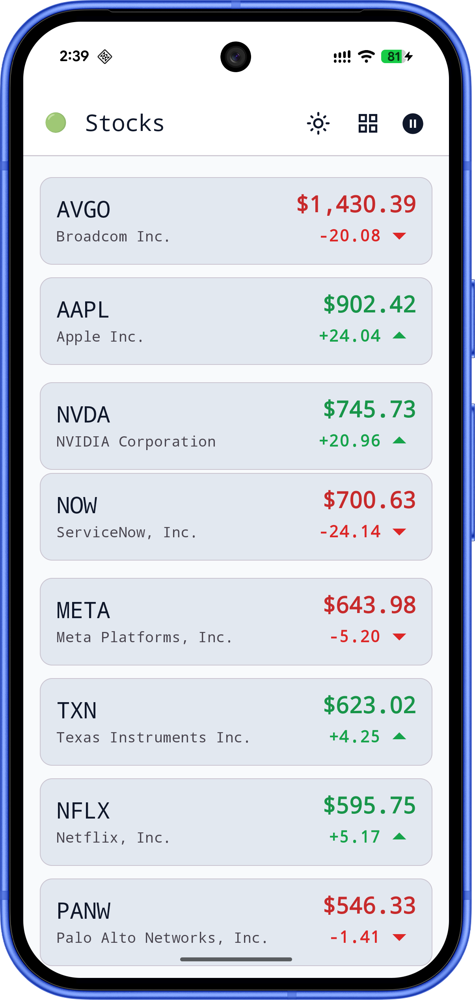
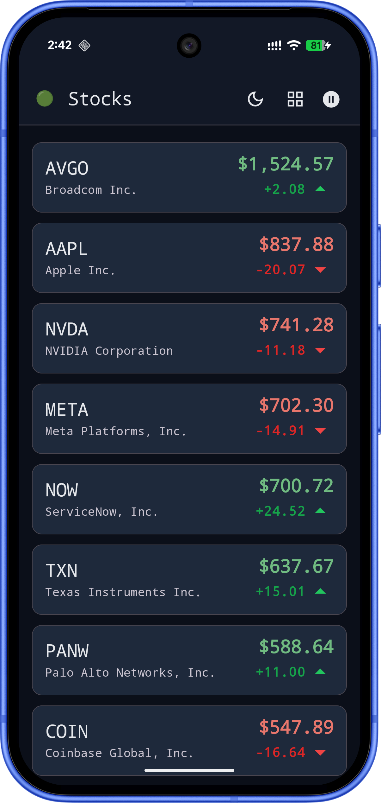
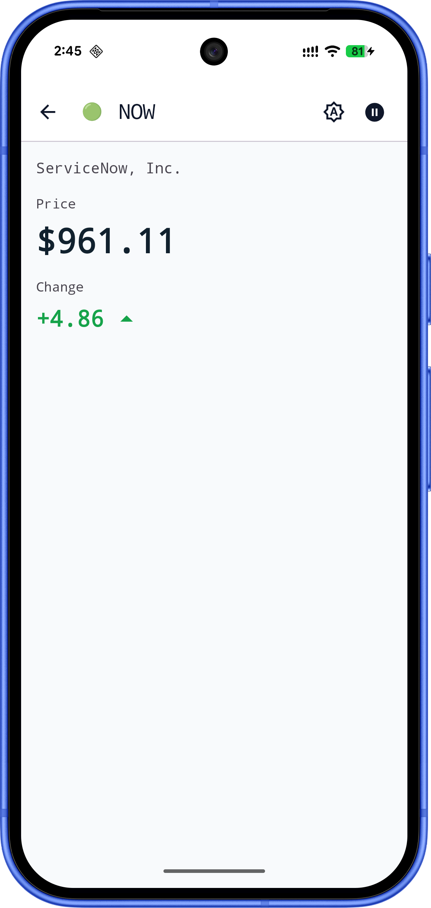
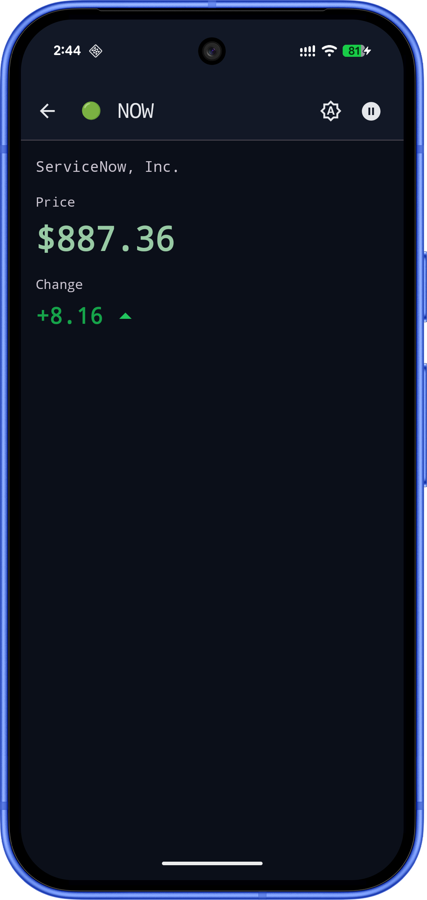
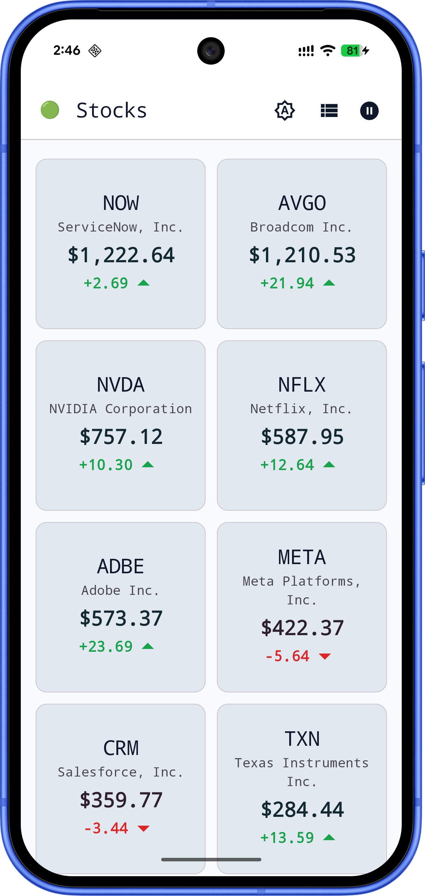
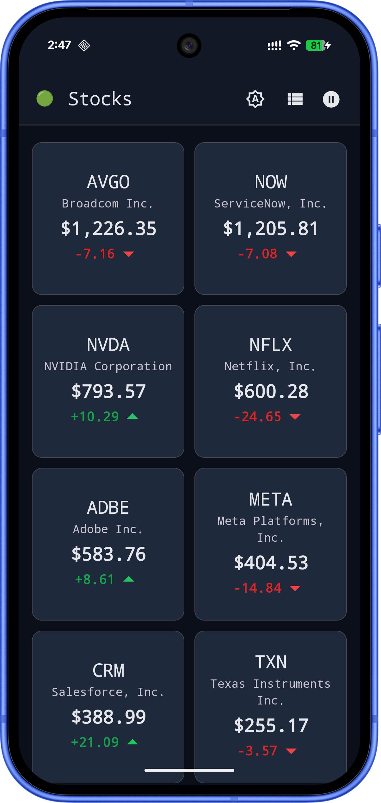
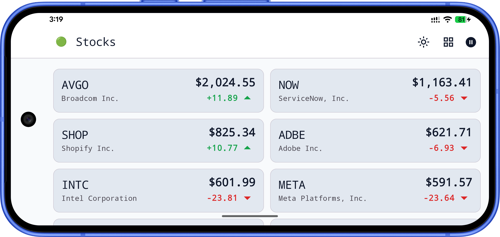
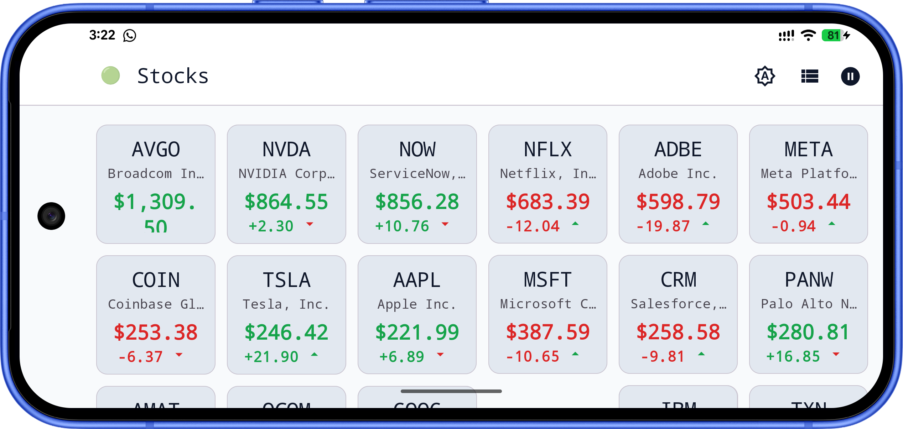

[](https://github.com/moinkhan-tech-in/AtomicTracker/actions/workflows/ci.yml)

# 📈 AtomicTracker

A **demo Android stock tracker** built with **Jetpack Compose** and a **layered architecture**. Browse a live-style quote feed, open symbol detail, and toggle streaming updates over a **real WebSocket** with **reconnect and backoff** — not UI-only timers.

## ✨ Features

- **Stock feed** — list of quotes with price and change
- **Symbol detail** — dedicated screen per ticker (type-safe navigation)
- **Deep links** — open the feed (`stocks://feed`) or a symbol detail (`stocks://symbol/{symbol}`) via `VIEW` intents
- **Live feed** — pause/resume the WebSocket-driven ticker; connection state (connecting / connected / disconnected) in the UI on feed and detail
- **Theme** — light / dark / follow system switch (Material 3)

## 📸 Screenshots

**Feed / Detail**

<p align="start">
  
  
  
  
</p>

**Feed Grid**

<p align="start">
  
  
</p>

**Feed Adaptive Layout**

<p align="start">
  
</p>
<p align="start">
  
</p>

## 🎬 Demo video

Short walkthrough: live feed, WebSocket-driven updates, symbol detail, pause/resume, themes, and navigation.

https://github.com/user-attachments/assets/29a53e0e-7d85-4d14-8235-7aa7f9564b8c


## 🏗️ Architecture

Organized in a **single `app` module** with clear layers (Clean-style separation inside packages):

- **UI layer** — Jetpack Compose, feature screens (`feed`, `detail`), MVVM with `ViewModel` + `StateFlow`
- **Domain layer** — use cases and models under `core/domain` (no UI)
- **Data layer** — `StockRepository`, `NetworkStocksDataSource`, DTOs, mappers, WebSocket client under `core/data`
- **Navigation** — Compose Navigation with **kotlinx.serialization** routes (`FeedRoute`, `DetailRoute`)
- **Design system** — shared theme, scaffold, and components under `core/designsystem`
- **DI** — **Hilt** modules in `di/` (`NetworkModule`, `RepositoryModule`, `UseCaseModule`, `DataSourceModule`)


## 🧩 Tech Stack

- **UI**: Jetpack Compose, Material 3
- **Architecture**: Layered packages, MVVM, use cases + repository
- **Async**: Kotlin Coroutines, Flow
- **DI**: Hilt
- **Networking**: OkHttp (WebSocket for live feed; JSON via kotlinx.serialization)
- **Serialization**: kotlinx.serialization (navigation + JSON for quotes)
- **Code quality**: Detekt (`config/detekt/detekt.yml`)
- **Testing**: JUnit, Turbine, kotlinx-coroutines-test (see Testing)


## 📁 Project Structure

Single-module layout; source under `app/src/main/java/com/challange/atomictracker/`:

```
AtomicTracker/
├── app/                              # Application module
│   └── src/main/java/.../atomictracker/
│       ├── app/                      # Application class, MainActivity
│       ├── core/
│       │   ├── designsystem/         # Theme, components, widgets
│       │   ├── navigation/           # Nav host, type-safe routes
│       │   ├── domain/               # Models, use cases
│       │   └── data/                 # Repository, datasources, WS, mappers
│       ├── feature/
│       │   ├── feed/                 # Feed screen + ViewModel
│       │   └── detail/               # Detail screen + ViewModel
│       └── di/                       # Hilt modules
└── gradle/                           # Version catalog (libs.versions.toml)
```


## 🔗 Deep links

The app registers **`stocks`** URIs on `MainActivity` and uses Navigation Compose **`navDeepLink`** with type-safe routes (`FeedRoute`, `DetailRoute`).

| URI | Opens |
|-----|--------|
| `stocks://feed` | Feed (start destination) |
| `stocks://symbol/{symbol}` | Symbol detail (e.g. `stocks://symbol/AAPL`) |

**Try with adb:** `adb shell am start -a android.intent.action.VIEW -d "stocks://symbol/NVDA" -n com.challange.atomictracker/com.challange.atomictracker.app.MainActivity`


## 🧪 Testing

**Unit tests** — `app/src/test/kotlin/com/challange/atomictracker/`:

```
test/kotlin/.../atomictracker/
├── MainDispatcherRule.kt
├── core/
│   ├── data/DefaultStockRepositoryTest.kt
│   └── domain/
│       ├── fakes/FakeStockRepository.kt
│       └── usecase/
│           ├── GetFeedStocksFlowUseCaseTest.kt
│           ├── GetLiveFeedConnectionStateFlowUseCaseTest.kt
│           ├── GetStockSymbolFlowUseCaseTest.kt
│           └── SetLiveFeedEnabledUseCaseTest.kt
└── feature/
    ├── feed/FeedViewModelTest.kt
    └── detail/DetailViewModelTest.kt
```


### Running checks

```bash
./gradlew testDebugUnitTest
./gradlew detekt
```


## 🤖 CI/CD

[GitHub Actions](https://github.com/moinkhan-tech-in/AtomicTracker/actions/workflows/ci.yml) runs on **push** and **pull requests** to `main`:

- Detekt static analysis
- `testDebugUnitTest`


## 🚧 Possible next steps

- Multi-module split (`:core:domain`, `:feature:feed`, …) if the app grows


## 👨‍💻 Author

**Moinkhan** — Android Engineer
